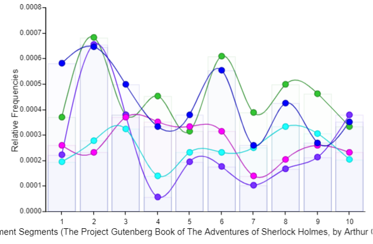
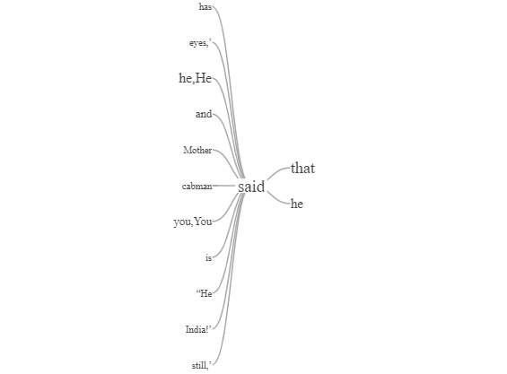
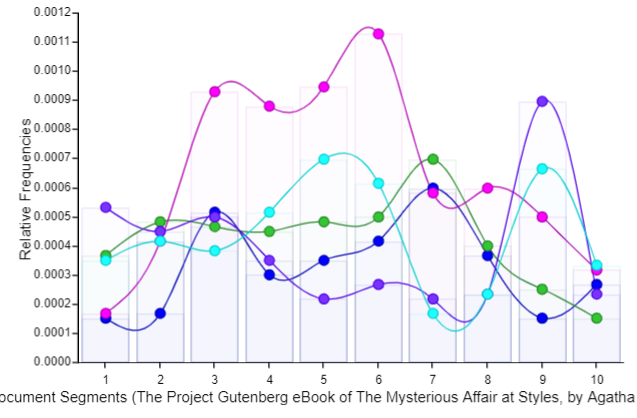
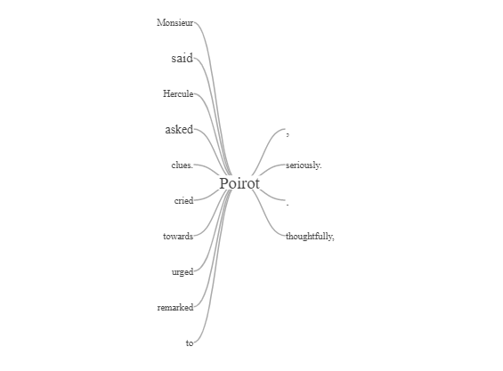

Final Research Project

By Aiyenigba Bolu

6675334

IASC 2P02

Professor Aaron Mauro

# Abstract

This study questions whether the evolution of a genre can be examined
through the deformation of the works of two influential authors across a
difference of a few decades. Deformation is a process by itself and can
be considered both an interpretation and something to be interpreted
(Samuels and McGann, 1999). This study asks if differences in genre
conventions can be noticed through the computational analysis of two
different authors' works. This study uses a novella of Sherlock Holmes
stories written by Sir Arthur Conan Doyle and "The Mysterious Affair at
Styles" by Agatha Christie. These two stories are then run through the
web-based analysis tool, Voyant.

# Introduction

The literary examination of a piece of work is an in-depth process that
takes time and focus. The method of such literary interpretations is
usually defined by close reading. Close reading refers to the act of
reading a piece of literature to notice details and connections and form
a cohesive theme or idea around these details. The article or idea
discussed this way is usually discovered after reading the literature
multiple times and examining the notes taken. Samuels and McGann (1999)
discuss the process of deforming a piece of literature and using that
new creation to explore the original work. The issue with close reading
is that spending so much time with a work of literature might leave the
reader dulled to certain aspects of the work. The idea behind
deformation is to break apart the intended literature and put it back
together to allow the reader to observe it from a new perspective. This
study seeks to examine if and how a genre evolves across a period of a
few decades and a World War. A genre's stylings should be evident
regardless of the state of their work, deformed or otherwise. Through
Voyant, this study will analyze if and how a genre changes through the
years and what elements stay the same. Also, the features that remain
the same will be discussed after the results of the study are revealed.
Breaking down a piece of literature should provide enough details and
specific information in order for a viewer to compare its components to
the conventions of a genre. Even though, close reading would likely be a
better fit for a study like this, using Voyant is important to determine
the methodology of using computers to analyse literature (Kirschenbaum,
2010). https://arcg.is/1Gi0nL0

<embed src="https://storymaps.arcgis.com/stories/e3ed31efa5804c30940469701117dc09" width="100%" height="500px">

# Methods

The process began by selecting two stories from the same genre from the
Sherlock Holmes' era and the "Golden era" (Humpherys, 2017). Using the
Gutenberg database, the stories were first, a novella of Sherlock Holmes
stories by Arthur Conan Doyle and "The Mysterious Affair at Styles" by
Agatha Christie. The novella of Sherlock Holmes stories was written
between 1891-1894 while "The Mysterious Affair at Styles" was written in
1916 and published in 1920. Both stories are of the British detective
fiction genre. The first text was the first Sherlock Holmes' story
written by the author while the second is the last. Voyant is the
primary tool used in this study. It is a web-based analysis and reading
tool for digital texts. Voyant is the \"deformation\" tool this study
will use to examine the two texts. Both texts were entered into the
website, Voyant and the tool\'s analysis of the texts was produced.
Specific terms that were irrelevant to this study had to be removed from
the data results of the tool\'s investigation, such as
\"gutenberg.org,\" which is the site of the stories\' online
publication. The display of the timeline of the publishing of each
corpus will be done through the tool, StoryMaps. It provides a clear and
evident display of the timeline and the reason why an evolution of the
genre might have happened (Drucker, 2011).

# Results

The above images are the trend chart of the Holmes novella and its word
tree chart. For the trend chart, green is "said," purple is "mr," blue
is "holmes," pink is "man," and cyan is "little." The word chart is a
visualization that connects the most used word with its various contexts
and accompanying words in order of frequency. The center word of the
chart is "said." This corpus has a vocabulary index of 0.076, a
readability index of 7.407 and an average word per sentence count of
16.2.

The above trend chart has green for "said," blue for "yes," pink for
"Poirot," purple is "mrs," and cyan for "inglethorp." The word chart has
its center or stem word as "Poirot" who is the detective lead of the
Agatha Christie novel. This corpus has a vocabulary index of 0.094, a
readability index of 8.201 and an average word per sentence count of
11.6.

# Discussion

When looking at the two trend charts, there is no significant difference
in the words in the chart between the two texts. There are the words
"said", "Mr."/" Mrs." and the name of their starring detective. The word
"man" in the trend chart of the Sherlock stories don't seem be anything
other than a product of his writing style. Its presence could also be
seen as the evidence of the stories focus on male characters. The other
words in each trend chart are context specific to the plot of the texts
that they come from. If we compare the most important words and similar
words in each text, we can attribute a convention of the genre to each
word. "Mr." and "Mrs." represent the wealthy client and the suspects.
"Said" represents the narration of the sidekick or outside observer and
the name of the detective represents the rational detective solving the
mystery.

The trend chart graphs, on the other hand, present some interesting
data. "Holmes" follows a wave-like pattern in the Sherlock corpus while
"Poirot" has a mountain-like pattern on the graph. Holmes is
consistently present throughout his stories while Poirot is not as
frequently mentioned at the beginning and ending of the text. The word
"said" is present on both charts and presents an interesting contrast
which could be either an evolution of style or genre. "Said" has a high
frequency of occurrence in the Holmes stories, almost as much as the
word "holmes." On the other hand, "said" has a much more moderate
presence in the Agatha novel.

Looking at the word tree charts, it becomes clear that these texts are
similar, and any differences are the result of the author's style as
opposed to any evolution of the genre. There might be a method that
allows Voyant to explore the change in genre across different authors,
but the method used in this study is not it. The word tree of the
Sherlock stories explains why "said" was the most frequency used word in
that corpus but not in the Agatha corpus. The Poirot word tree
beautifully displays how Agatha Christie made use of verbs to replace
"said" in her novel. This is mostly a stylistic difference however and
shows no signs of a difference or evolution in genre. Instead, the
differences show a marked improvement in writing quality and style over
the years.

# References

Drucker, J. (2011). Humanities Approaches to Graphical Display. *Digital
Humanities Quarterly*, *5*.
<http://dblp.uni-trier.de/db/journals/dhq/dhq5.html#Drucker11>

Humpherys, A.  British Detective Fiction in the 19th and Early 20th
Centuries. *Oxford Research Encyclopedia of Literature.* Retrieved 9
Apr. 2023, from
<https://oxfordre.com/literature/view/10.1093/acrefore/9780190201098.001.0001/acrefore-9780190201098-e-240>.

Kirschenbaum, M. G. (2010). What Is Digital Humanities and What's It
Doing in English Departments? *ADE Bulletin*, 211--220.
https://doi.org/10.4324/9781315576251-15

Samuels, L., & McGann, J. (1999). Deformance and Interpretation. *New
Literary History*, *30*(1), 25--56. http://www.jstor.org/stable/20057521
